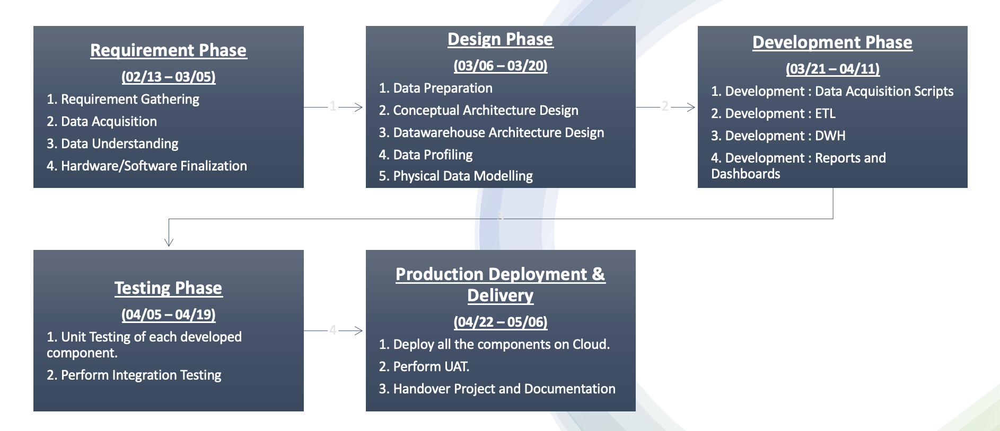

# Cloud Based New York Complaints and Events Data-Warehouse Analytics Solution

## Project Summary
The NYC Complaints and Events Analytics project is designed to build a robust data analytics platform using AWS cloud services. The primary objective is to analyze and visualize New York's event and complaint data, enhancing public safety operational strategies. Key stakeholders include New York's security departments and public safety officials who require real-time data to effectively manage and respond to city dynamics. Business requirements focus on real-time data acquisition, comprehensive analytics, and interactive reporting. Utilizing AWS EventBridge and Lambda for real-time data ingestion and processing, and AWS Glue for efficient ETL processes, the data is stored in Amazon Redshift for scalable data warehousing. The system employs Amazon Athena for ad-hoc query executions and Amazon QuickSight for dynamic visualizations, producing a monitoring dashboard that offers detailed insights into crime and event correlations. This end-to-end solution not only aids in strategic decision-making but also supports the security departments' need for actionable intelligence.

## Data Source and Background
* NYPD Complaint Data Historic: Features over 8.91 million records, accessible via [NYC Open Data API](https://data.cityofnewyork.us/Public-Safety/NYPD-Complaint-Data-Historic/qgea-i56i/about_data).
* Ready NYC Events: Contains details of NYC events, encompassing 4237 rows across 19 columns. Available in CSV format from [NYC Open Data](https://data.cityofnewyork.us/Public-Safety/Ready-NY-Events/hyur-qpyf/about_data).
* US Zip Codes: Includes latitude, longitude, and pincode for US zip codes. Open source data available on [GitHub](https://gist.github.com/erichurst/7882666).

## Team Members Roles and Responsibilities

* Ankit Kumar Aggarwal - Overall Project Management, Cloud Architecture Design, ETL, Data Warehouse Design, Monitoring Dashboard Design, Quality Assurance.
* Aravind  Raju - Data Acquisition: Source 1, Data Warehouse Development, Unit Testing and UAT
* Sameer Beloshe - Overall ETL Development, Reports & Dashboard Development, Unit Testing and UAT
* Venkata Sai Surya Athuluru - Data Acquisition: Source 2, Cloud Integration, Unit Testing and UAT

## Project Timeline

## Cloud Architecture - Conceptual Model

## Data Warehouse Star Schema Design

Below is the star schema design for our Data Warehouse, which supports the analytics for the NYC Complaints and Events Dashboard. This schema includes dimensions for Location, Crime Type, Victim, Suspect, and several other key elements necessary for comprehensive analysis.

This schema is optimized for querying large datasets to enable quick insights into crime patterns and correlations with event data in New York City.

## NYC Events Crime Analytics Dashboard Overview

This interactive dashboard visualizes comprehensive analytics derived from New York City's crime and events data. It offers insights into crime patterns, event participation, and geographical crime distributions across NYC's boroughs.

### Features Highlighted in the Dashboard:
- **Total Number of Complaints**: Quick metrics on the volume of complaints registered.
- **Complaint Distribution by Borough**: Pie chart visualization showing the proportion of complaints from each borough.
- **Top 10 Postcodes by Complaints**: Bar chart highlighting areas with the highest number of complaints.
- **Complaint Trends Over Time**: Line graph displaying trends in complaint volumes over time.
- **Complaints by Offense Type**: Breakdown of complaints categorized by types of offenses.
- **Geographical Crime Map**: A detailed map view showing crime distribution by longitude and latitude.

This dashboard provides actionable insights that can help in strategic planning and operational adjustments for city safety and event management.

